# Congressional Advocacy Platform — Product Requirements Document

**Status:** PRD v1.0 — Ready for team review  
**Prepared for:** Modern Money Lab US / Public Money Action  
**Author:** Chris Bland  
**Date:** 2026-03-06

---

## 1. Vision Statement

Congressional hearings are where economic policy is shaped in public. The questions asked in those hearings define the boundaries of acceptable debate, establish what counts as common sense, and enter the permanent public record. Yet the staffers who prepare those questions are chronically under-resourced: early-career professionals juggling multiple issue areas, often working from incomplete briefing materials with days or hours of lead time.

This platform exists to close that gap while advancing a specific strategic objective. By providing Congressional staffers with high-quality, hearing-ready question packs grounded in sound economic reasoning, the platform delivers genuine value to overstretched offices while embedding economic framing consistent with Modern Monetary Theory into the Congressional record. The framing is never labelled as MMT. It does not need to be. The goal is to make accurate economic reasoning the path of least resistance for a staffer under time pressure.

The platform is not a content management system or a publishing tool. It is an intelligence and relationship engine. It combines automated hearing discovery, AI-assisted question drafting, structured outreach, and a continuously updated research database of congressional members' economic positions. The research layer is what makes the platform strategic rather than reactive: by tracking who says what about fiscal policy, the system can identify which members are already sympathetic, which are persuadable, and where the highest-leverage opportunities lie for each upcoming hearing.

The ambition is to build a small team's capacity to engage systematically with hundreds of Congressional offices, to learn from every interaction, and to compound that learning over time. At scale, this means that when a hearing on federal spending is scheduled, the platform already knows which committee members have shown openness to counter-cyclical reasoning, which staffers have used prior materials, and what framing has worked best in similar contexts. The team does not start from scratch each week. The system carries the institutional memory.

Success in the first session (ending October 2026) is defined concretely: 25 or more warm staffer relationships and approximately 20 questions used in hearings that carry the intended economic framing. These are relationship and record outcomes, not vanity metrics.

---

## 2. Strategic Decisions (Resolved)

The following decisions were made during the preliminary review and are now incorporated as constraints.

| Decision | Resolution | Implication |
|---|---|---|
| Operating entity | Likely Public Money Action (501c4), pending confirmation. MML US (501c3) requires neutral positioning. | Platform branding and disclosure language depend on entity. PRD accommodates either. |
| MMT naming | MMT is never mentioned in any outward-facing content. | Question packs use sound economic reasoning without labelling it. Internal playbook maps MMT concepts to neutral language. |
| Target committees | Budget, Finance, Appropriations, Labor (Senate and House). | Hearing discovery filters prioritise these four. Others included only if flagged manually. |
| Launch volume | No more than 5 hearings per week. | Phase 1 automation designed for this throughput. Review workflow sized accordingly. |
| Review team | Susan, Danny, Brenna, Trip. | Four reviewers with Trip as relationship owner and final authority on outreach. |
| Relationship ownership | Trip owns all staffer relationships, with delegation authority. | CRM records Trip as primary; delegated contacts tagged to secondary owner. |
| Witness targeting | Prioritise minority/Democratic witnesses. Include yes/no questions with follow-up for hostile witnesses. | Question generation engine handles both cooperative and adversarial witness strategies. |
| Success metrics | 25+ warm contacts by Oct 2, ~20 questions used in hearings. | Tracking system must measure both relationship warmth and question adoption. |
| Hearing schedule cadence | Committees typically post schedules one week before. Target: usable hearing list by Thursday/Friday for weekend preparation. | Discovery agent runs daily; triage output delivered by Thursday. |
| Staffer data | Legistorm subscription likely required (~$200/month). Manual lookup initially. | Phase 1 uses manual Legistorm lookups. Phase 2 explores alternatives (see Section 7). |
| Content playbook | Does not exist yet. To be generated using LLM parsing of MMT source material. | Playbook creation is a Phase 1 prerequisite (see Section 9). |
| Question format | Untested with Congressional offices. | Phase 1 includes format testing with friendly offices before scaling. |

---

## 3. System Architecture Overview

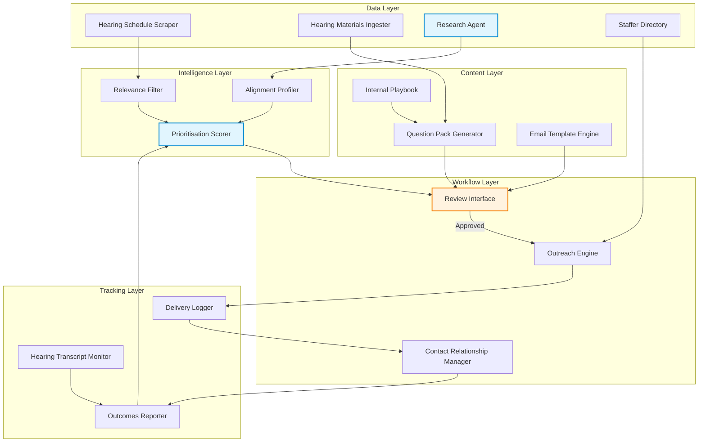

---

## 4. Core Workflows

### 4.1 Hearing Discovery and Triage

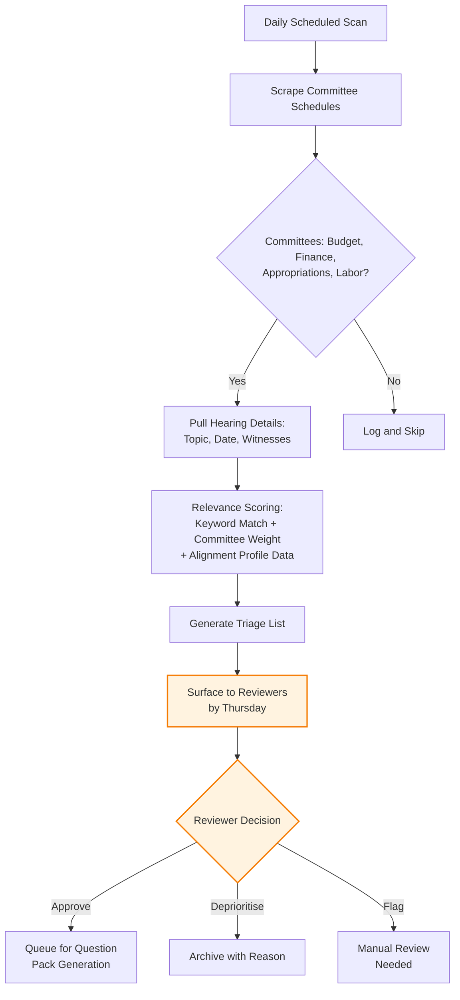

**Human-in-the-loop checkpoint:** Reviewers must approve or deprioritise every hearing before question pack generation begins. No hearing proceeds to content generation without explicit sign-off.

**Data sources:**
- Congress.gov API for hearing schedules
- Committee RSS feeds as backup
- Manual additions by Trip for hearings flagged through relationships

---

### 4.2 Question Pack Generation

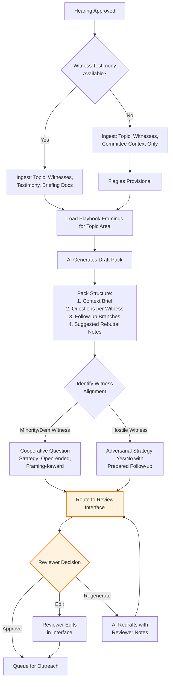

**Human-in-the-loop checkpoint:** Every question pack requires reviewer approval before outreach. Reviewers can edit directly or request regeneration with notes. No pack leaves the system without sign-off.

**Rebuttal depth recommendation (v1):** Include one level of follow-up branching per question. Structure as "if the witness responds with X, consider Y." Keep it suggestive rather than scripted. This is enough to be useful without requiring the content investment of full decision trees. Deeper branching can be tested in Phase 2 based on staffer feedback.

**Pack format (initial):** PDF document with clear section headers. One page of context, then questions grouped by witness. Five-minute round structure respected. Total length: 3-5 pages.

---

### 4.3 Staffer Targeting and Outreach

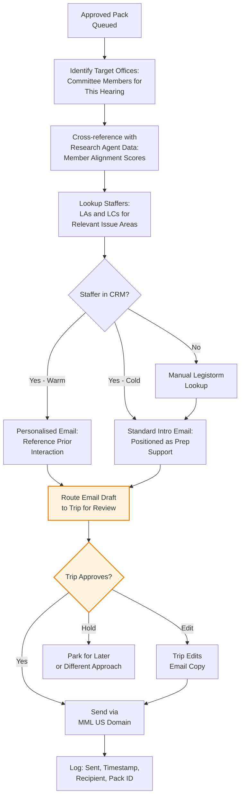

**Human-in-the-loop checkpoint:** Trip (or delegated reviewer) approves every outreach email before send. Pre-approved templates may reduce this to spot-checking in later phases, but Phase 1 requires full review.

**Opt-out mechanism:** Every outreach email includes a one-click opt-out link. Opt-outs are processed automatically and immediately suppress future sends. Opt-out list is maintained at the platform level, not per-reviewer.

---

### 4.4 Tracking and Outcome Measurement

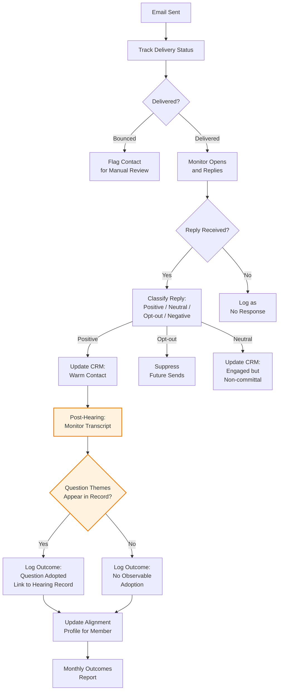

**Human-in-the-loop checkpoint:** Transcript monitoring and question adoption scoring require human judgment initially. Automated keyword matching can flag potential matches, but a reviewer confirms whether the framing was genuinely adopted or merely coincidental.

---

## 5. Research Agent — Congressional Intelligence Database

This is a new system component not present in the preliminary specification. It addresses the need for continuous tracking of congressional members' economic positions to enable strategic prioritisation.

### 5.1 Purpose

The research agent maintains a live intelligence database of all members of the target committees. It tracks public statements, hearing questions, floor speeches, voting records, and co-sponsorships to build a rolling profile of each member's alignment (or misalignment) with the economic reasoning the platform promotes. This data feeds into every other system component: hearing prioritisation, staffer targeting, question framing, and outcome measurement.

### 5.2 Architecture

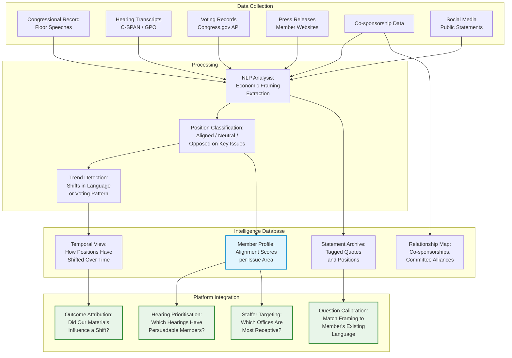

### 5.3 Key Issue Areas for Tracking

The alignment profiler scores members across specific economic policy dimensions. These are not labelled as "MMT issues" but as standard fiscal policy positions:

1. **Federal spending and deficits** — Does the member treat deficits as inherently dangerous, or as context-dependent?
2. **Inflation causation** — Does the member attribute inflation to government spending, or to supply-side factors, pricing power, and market structure?
3. **Full employment** — Does the member support federal job guarantee concepts or public employment programs?
4. **Currency sovereignty** — Does the member's language reflect understanding that a currency-issuing government faces different constraints than a household?
5. **Public investment** — Does the member frame infrastructure, healthcare, or education spending as investment or as cost?
6. **Taxation purpose** — Does the member discuss taxation primarily as revenue-raising, or as a tool for managing demand and inequality?

Each member receives a score from -2 (actively hostile to aligned framing) to +2 (already using aligned framing) on each dimension, updated as new data is ingested.

### 5.4 Prioritisation Logic

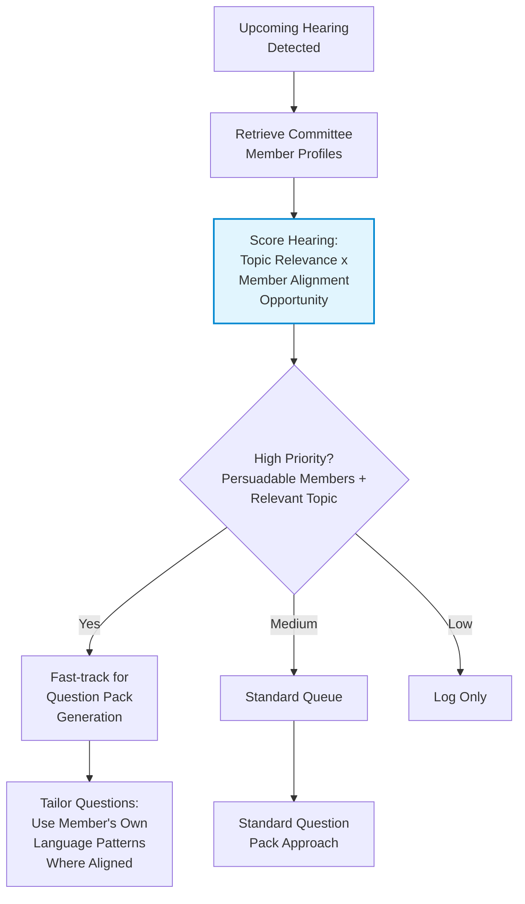

The key insight here is that the most valuable targets are not members who are already fully aligned (they need less help) or members who are deeply opposed (they will not use the materials). The highest leverage is with members in the -1 to +1 range who have shown some openness on some dimensions. The research agent identifies these opportunities automatically.

### 5.5 Human-in-the-Loop for Research Agent

The research agent operates with a lighter review requirement than the outreach workflow, since its outputs are internal. However:

- **Alignment score overrides:** Reviewers (particularly Trip, given his relationships) can manually override any member's alignment score with a note explaining why.
- **Flagged shifts:** When the agent detects a significant change in a member's position (e.g., a floor speech that contradicts prior voting), it flags this for human review before updating the profile.
- **Quarterly audit:** The team reviews a sample of member profiles quarterly to check the agent's scoring accuracy.

---

## 6. Technical Requirements

### 6.1 Data Infrastructure

| Component | Requirement | Notes |
|---|---|---|
| Hearing schedule data | Congress.gov API, committee RSS feeds | Daily polling. Cache locally. |
| Hearing materials | Committee websites, GPO | Scrape testimony PDFs where available. Handle late/missing materials gracefully. |
| Congressional Record | GPO bulk data, Congress.gov | Floor speeches, hearing transcripts for research agent. |
| Voting records | Congress.gov API, ProPublica API | Roll call votes mapped to issue dimensions. |
| Staffer directory | Legistorm (manual initially), House/Senate directories | Phase 1: manual lookup. Phase 2: explore alternatives (see Section 7). |
| Member press releases | Official websites | RSS where available; periodic scrape otherwise. |

### 6.2 AI/LLM Requirements

| Function | Model Requirements | Notes |
|---|---|---|
| Question pack drafting | Long context, high quality reasoning, instruction following | Needs to hold hearing materials + playbook + witness context simultaneously. |
| Economic framing analysis | Classification capability, nuance in political language | Research agent NLP. Must distinguish genuine fiscal policy positions from rhetorical boilerplate. |
| Email personalisation | Tone matching, concise output | Lower complexity than question generation. |
| Playbook generation | Synthesis from source material (Bill Mitchell, academic MMT literature) | One-time task with periodic updates. |

### 6.3 Infrastructure

| Component | Recommendation |
|---|---|
| Hosting | Cloud-hosted web application (likely a lightweight Python/Node backend with a simple frontend). |
| Database | PostgreSQL for structured data (members, hearings, contacts, scores). Vector store for document retrieval if needed. |
| Email sending | Transactional email service (e.g., Postmark, SendGrid) on MML US domain. DKIM/SPF/DMARC configured. Low volume (under 100/week) avoids deliverability issues. |
| Review interface | Web-based dashboard. Accessible to Susan, Danny, Brenna, Trip. Role-based access: Trip has full authority; others can review and edit but not send. |
| Document generation | PDF output for question packs. Templated, branded consistently. |

### 6.4 Compliance Requirements

| Area | Requirement | Status |
|---|---|---|
| Lobbying disclosure | Determine whether outreach constitutes lobbying under LDA based on operating entity (501c3 vs 501c4). | **Pending: entity decision required.** |
| CAN-SPAM / email compliance | Opt-out mechanism, sender identification, physical address in emails. | Built into platform. |
| Data scraping | Prefer APIs. Review ToS for any scraped source. Rate-limit and cache. | Ongoing. |
| Legistorm terms | No automated extraction. Manual lookups only unless terms permit otherwise. | Manual workflow in Phase 1. |

---

## 7. Legistorm Alternatives Assessment

Trip raised the question of whether the $200/month Legistorm cost can be avoided. Options:

1. **Legistorm (recommended for Phase 1):** Most comprehensive staffer directory. Manual lookups are unambiguously permitted. $200/month is modest relative to the value of accurate targeting. Recommended as the baseline.

2. **House and Senate public directories:** Free. Staffers are listed on official member websites and in the Congressional Directory. Coverage is incomplete: not all offices list issue-area assignments. Usable as a supplement, not a replacement.

3. **LinkedIn and public profiles:** Free but labour-intensive. Useful for confirming role and issue area once a name is known. Not a primary discovery tool.

4. **Relationship-based enrichment:** As Trip builds relationships, staffers will naturally identify the right contacts in other offices. This scales slowly but is the most reliable data.

**Recommendation:** Start with Legistorm. Reassess at the end of Phase 1 based on actual usage patterns. If the team is only targeting 5 hearings/week across 4 committees, the number of unique staffer lookups may be manageable through public directories alone.

---

## 8. Complete System Workflow — End to End

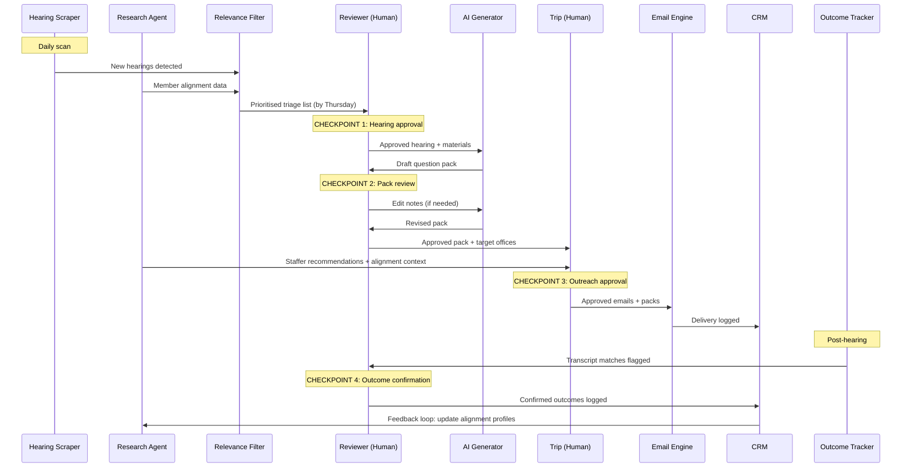

---

## 9. Phased Development Plan

### Phase 1 — Foundation and Validation (Weeks 1-6)

**Objective:** Prove the concept works manually, produce the content playbook, test question pack format with friendly offices, and establish baseline workflows.

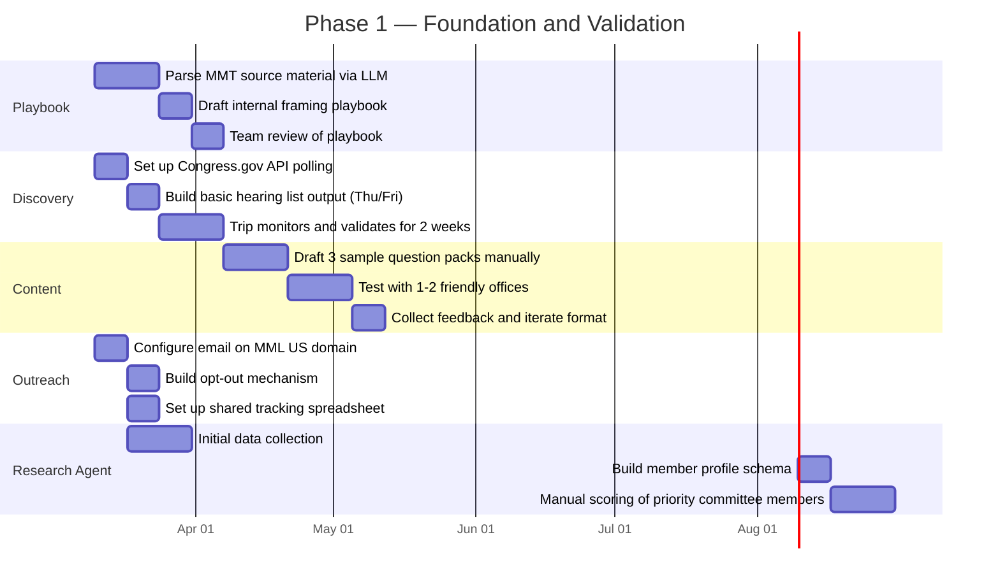

**Key outputs:**
- Internal content playbook mapping MMT concepts to neutral economic language
- Validated question pack format based on real staffer feedback
- Working hearing discovery list delivered weekly
- Initial member alignment profiles for target committees
- Functional email outreach with opt-out handling

**Phase 1 does not require custom software.** It uses: Congress.gov API scripts, an LLM (Claude) for playbook parsing and question drafting, a shared spreadsheet for tracking, and a professional email client. The research agent begins as a structured spreadsheet of member profiles with manual scoring.

---

### Phase 2 — Automation and Integration (Weeks 7-14)

**Objective:** Automate the repeatable parts of the workflow and build the review interface.

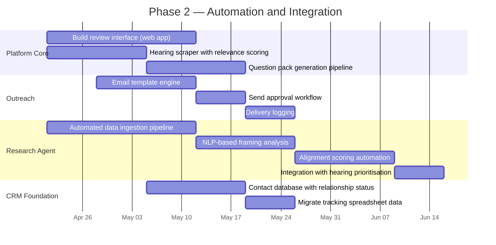

**Key outputs:**
- Web-based review interface for the four reviewers
- Automated hearing discovery with relevance scoring
- AI-generated question packs routed through the review workflow
- Research agent producing automated alignment scores
- Basic CRM replacing the shared spreadsheet

---

### Phase 3 — Intelligence and Optimisation (Weeks 15-22)

**Objective:** Close the feedback loop. Make the system learn from its own outcomes.

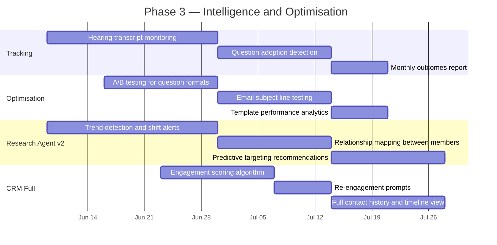

**Key outputs:**
- Outcome tracking with transcript monitoring
- Evidence-based template and format refinement
- Research agent producing shift alerts and predictive targeting
- Full CRM with engagement history and automated re-engagement suggestions
- Monthly report to the team summarising what worked

---

## 10. Human-in-the-Loop Summary

The platform has four mandatory human checkpoints. No automation bypasses these without explicit future authorisation by the team.

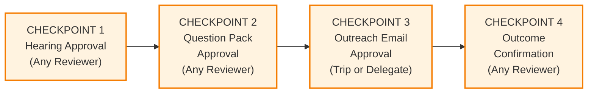

| Checkpoint | Who | What They Approve | Consequence of Bypass |
|---|---|---|---|
| 1. Hearing Approval | Any of the four reviewers | Whether a hearing is worth targeting | Wasted content generation effort |
| 2. Pack Approval | Any of the four reviewers | Quality, accuracy, and framing of question pack | Reputational damage with staffers |
| 3. Outreach Approval | Trip (or explicit delegate) | Email copy, targeting, and timing | Relationship damage, opt-outs, spam risk |
| 4. Outcome Confirmation | Any of the four reviewers | Whether a question was genuinely adopted in a hearing | Inflated success metrics, bad strategic decisions |

---

## 11. Risks Carried Forward

These risks from the preliminary specification remain active and require ongoing attention.

| Risk | Severity | Mitigation | Owner |
|---|---|---|---|
| Entity decision delays platform branding and disclosure | High | Proceed with entity-neutral language. Finalise before Phase 2 outreach at scale. | Trip/Susan |
| Question packs read as ideological | High | Human review checkpoint. Playbook enforces neutral language. Regular staffer feedback. | Reviewers |
| Lobbying registration required | High | Legal review before any outreach begins. Entity choice (501c3 vs 501c4) is the primary variable. | Trip/Susan |
| Review bottleneck at 5 hearings/week | Medium | Four reviewers share load. Tiered review for routine vs high-priority packs. | All reviewers |
| Staffer data accuracy | Medium | Bounce handling. Manual validation. Relationship-based enrichment over time. | Trip |
| Hearing materials posted late | Medium | Provisional packs flagged clearly. Freshness checks before send. | System + Reviewers |
| Research agent scoring inaccuracy | Medium | Manual override capability. Quarterly audit. Start with manual scoring in Phase 1 to calibrate. | Trip |
| Small team burnout | Medium | Platform must reduce total work, not add it. Phase 1 validates workload before committing to automation. | All |

---

## 12. Items Pending Resolution

| Item | Required Before | Responsible |
|---|---|---|
| Operating entity confirmation (MML US 501c3 vs PMA 501c4) | Phase 2 outreach | Trip/Susan |
| Legal review of lobbying obligations under chosen entity | Phase 1 outreach | Trip/Susan |
| Legistorm subscription activation | Phase 1 staffer lookups | Trip |
| Identification of 1-2 friendly offices for format testing | Phase 1 content validation | Trip |
| Content playbook review and sign-off by team | Phase 1 question generation | All reviewers |

---

*This document supersedes the Preliminary Product Specification (v0.1, 2026-02-27). It should be reviewed by the MML US team and updated as pending items are resolved. Development work begins with Phase 1 activities, which require no custom software build.*
