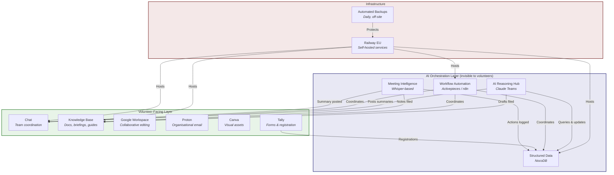
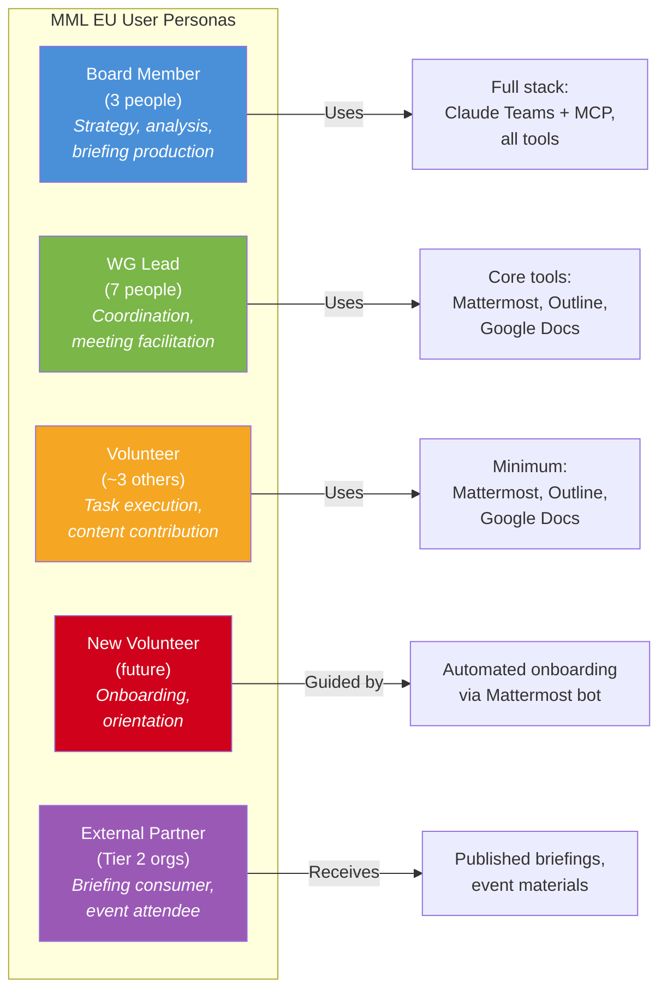
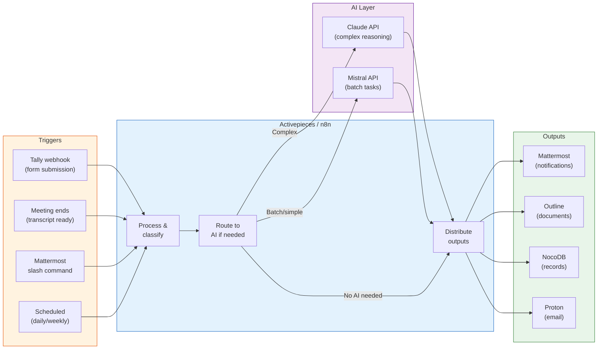

# MML EU Internal Communications Platform
## Product Requirements Document

**Version:** 1.0
**Date:** March 2026
**Author:** Internal Communications Working Group
**Audience:** Internal Comms WG, Board, Steering Group
**Status:** Draft for WG Review

---

## 1. Vision

MML EU exists to arm Europe's progressive movements with the economic arguments they need to win. Trade unions, climate coalitions, housing campaigns, and healthcare advocates lose policy fights not because they lack evidence, but because they lack the fiscal argumentation to counter a single objection: "how will we pay for it?"

To supply that argumentation at scale across a continent, a 13-person volunteer organisation needs to operate with the efficiency of a team five times its size. This document specifies how.

The platform described here is not a collection of tools. It is an operating system for a distributed advocacy organisation. Volunteers open familiar applications (a chat window, a wiki page, a shared document) and work normally. Beneath the surface, an AI-orchestrated automation layer captures institutional knowledge, routes information to the right people, eliminates repetitive administrative work, and ensures that nothing important is lost when a volunteer steps away.

This architecture has been validated. The OpenClaw/Felix experiment demonstrated that a single person, checking in a few times a day, can produce output equivalent to a small team by encoding institutional knowledge as reusable markdown assets and letting AI orchestration handle the coordination. MML EU does not need to replicate that scale. It needs to apply the same structural principle: encode knowledge, automate coordination, and reserve human time for the work that only humans can do, which is building trust and relationships with the progressive organisations we serve.

The result is an organisation where:

- A new volunteer can onboard themselves and become productive within a day, because the knowledge base contains everything they need.
- A board member can research a policy question, draft an ammunition briefing, file it to the knowledge base, and notify the relevant working group, without switching applications.
- Meeting decisions are automatically captured, structured, and distributed so nothing falls through the cracks.
- The organisation's collective knowledge survives the departure of any single person.

---

## 2. Context and Constraints

### 2.1 Organisational Profile

MML EU is a French association (loi 1901) with approximately 13 volunteers distributed across seven working groups and multiple European countries. The board consists of three members. Working groups operate semi-autonomously with coordination through regular meetings and shared documentation.

Summer events in Stockholm (June 27) and Brussels (June 28-29) serve as the forcing function for Phase 1 readiness.

### 2.2 Design Constraints

All platform decisions are evaluated against four criteria, in priority order:

1. **GDPR compliance** -- legal baseline, non-negotiable
2. **EU data residency** -- strategic preference, especially for personal data
3. **Cost-effectiveness** -- volunteer organisation budget (target: under EUR 150/month)
4. **Volunteer usability** -- adoption depends on low friction; non-technical volunteers must not interact with AI tools directly

### 2.3 Current State

MML EU currently operates on WhatsApp for coordination and Google Docs for shared documents. This baseline creates three documented problems: knowledge disappears as conversations scroll past, nothing is connected across working groups, and personal data resides on US servers without organisational control.

### 2.4 Key Architectural Principles

**Two-layer architecture.** Volunteers use familiar tools (chat, wiki, documents). AI orchestration operates invisibly beneath, delivering outputs without requiring volunteer interaction with AI tools. This principle was identified early in our planning and independently validated by the Felix/OpenClaw experiment, where institutional knowledge encoded as structured markdown files enabled AI to produce consistent, quality output at scale.

**CLI-first where possible.** Recent analysis of MCP token overhead revealed that connecting multiple MCP servers to Claude can consume 30-50% of the context window before any work begins. The CLI-first principle, drawn from the broader AI tooling community's experience, means preferring command-line interfaces (which cost approximately 200 tokens) over MCP connections (which can cost 55,000+ tokens per server) for developer workflows. For MML EU, the practical implication is: use MCP where it provides genuine value (interactive Claude sessions with board members), but route automated workflows through CLI tools and APIs via the automation layer, not through MCP.

**Ammunition as reusable assets.** Every argumentation sequence, briefing framework, and counter-objection we develop should be stored as a structured, retrievable document. These are not one-off outputs; they are the organisation's intellectual inventory.

**EU data sovereignty is tiered, not absolute.** AI reasoning (Claude) is an accepted US-hosted exception for strategy and analysis. Personal data (member contacts, event registrations, partner details) requires EU-resident infrastructure. Working documents follow the pragmatic middle ground.

---

## 3. Platform Architecture

### 3.1 Architecture Overview

### 3.2 The Anytype Question

Anytype is a Swiss-based, local-first, end-to-end encrypted workspace that combines documents, databases, and chat in a single application. It is open-source, self-hostable, and aligns strongly with MML EU's data sovereignty values. Its pricing (free tier with 1GB storage and 3 shared spaces; paid plans from $99/year) is competitive.

Anytype's potential value for MML EU is consolidation. Instead of running separate services for wiki (Outline), structured data (NocoDB), and chat (Mattermost), Anytype could theoretically replace all three. This would reduce infrastructure complexity, lower the bus factor risk, and give volunteers a single application to learn.

However, evaluation has identified three constraints that currently prevent full adoption:

1. **MCP integration gap.** Anytype's official MCP server is a local stdio process requiring a workaround (anytype-cli + Supergateway bridge on Railway) to connect to Claude.ai web. Outline and NocoDB have cleaner remote HTTP MCP integrations. The MCP protocol spec targets stateless HTTP improvements for June 2026, which may resolve this natively.

2. **Chat API gap.** Anytype's REST API currently covers objects, spaces, properties, and search, but not chat. Automated workflows cannot post messages into Anytype chat channels, which eliminates the notification layer required by every use case in this PRD. Mattermost has a mature webhook API with native automation node support.

3. **Collaboration maturity.** Anytype's team features are newer and less battle-tested than Mattermost and Outline, which have years of deployment in team environments.

**Recommendation:** Track Anytype's API development. If chat API and native remote MCP support arrive (plausibly H2 2026), Anytype becomes a serious candidate for consolidating the wiki + database + chat stack into a single application. For now, proceed with the modular architecture (Mattermost + Outline + NocoDB) which has proven integration paths.

### 3.3 Technology Stack

| Function | Tool | Hosting | Cost | CLI/API | MCP |
|---|---|---|---|---|---|
| Team chat | Mattermost | Self-hosted, Railway EU | Free | Mature webhook + REST API | Official MCP server |
| Knowledge base | Outline | Self-hosted, Railway EU | Free | REST API, CLI export | Community MCP servers |
| Structured data | NocoDB | Self-hosted, Railway EU | Free | REST API | Built-in MCP |
| Collaborative docs | Google Workspace | US (Google) | Free (Nonprofits) | CLI tools available | Google Drive MCP |
| Email & calendar | Proton | Switzerland | ~EUR 7-13/user/month | Limited API | None |
| Design | Canva | Cloud | Free (Nonprofits) | API available | Official MCP |
| Forms | Tally | Belgium (EU) | Free tier | Webhooks | Official MCP |
| AI reasoning | Claude Teams | US (Anthropic) | ~EUR 90/month (3 seats) | API + Claude Code CLI | Hub for all MCP |
| Workflow automation | Activepieces* | Self-hosted, Railway EU | Free | REST API | n/a (is the orchestrator) |
| Meeting transcription | Whisper-based | Local / self-hosted | Free | CLI | n/a |
| Backup | Railway Postgres S3 | EU (separate provider) | ~EUR 5/month | CLI | n/a |

*Activepieces replaces n8n as the preferred automation tool due to n8n's documented security vulnerabilities (four critical RCE/sandbox escape CVEs in three months, late 2025 to early 2026). Activepieces is MIT-licensed, offers German-hosted cloud as a fallback, has a simpler UX (G2 setup rating 9.1 vs n8n's 7.7), and supports AI agent nodes. If the WG prefers n8n's deeper community template library, it remains viable with aggressive security patching.

### 3.4 Data Classification

| Data Type | Examples | Hosting Rule |
|---|---|---|
| Personal data | Volunteer contacts, event registrations, partner contacts | EU-resident self-hosted only (NocoDB, Mattermost, Proton, Tally) |
| Strategic/analytical | Strategy docs, briefings, research notes | Claude Teams, Outline, Google Docs acceptable |
| Working documents | Meeting notes, drafts, spreadsheets | Google Workspace acceptable for non-personal content |
| Public content | Website copy, social posts, published briefings | Any platform |
| Financial data | Budgets, expenses, grant applications | Proton Drive or self-hosted |

---

## 4. User Personas and Scenarios

### 4.1 Persona Map

### 4.2 User Scenarios

#### Scenario 1: Board Member Produces an Ammunition Briefing

**Persona:** Chris (Board, External Comms lead)
**Goal:** Draft a new ammunition briefing on EU defence spending exceptions for distribution to climate partner organisations.

**Workflow:**
1. Chris opens Claude Teams and starts a conversation in the MML EU project. Claude has persistent context including the Briefing Format and Style Guide, previous briefings, and the field analysis database.
2. Chris asks Claude to research the latest EU fiscal rule escape clause activations, referencing the partner database to identify which climate organisations are currently fighting green investment constraints.
3. Claude queries NocoDB via MCP for partner data, searches Outline for previous briefing content, and drafts a briefing following the established format.
4. Chris reviews and edits within the Claude conversation, then instructs Claude to file the draft to Outline under the Ammunition Drafts collection.
5. Claude files the document and posts a notification to `#ammunition-library` in Mattermost: "New draft briefing: Defence Spending Exceptions and Climate Investment. Ready for review."
6. Senada (lead economist, board member) reviews and provides feedback via Outline comments or Mattermost thread.

**Tools touched by Chris:** Claude Teams (with MCP to Outline, NocoDB, Mattermost)
**Tools touched by Senada:** Mattermost (notification), Outline (review)
**AI visibility:** Chris interacts with Claude directly. Senada sees only the finished output.

#### Scenario 2: WG Lead Runs a Meeting

**Persona:** Rachel (Events WG lead)
**Goal:** Run a working group meeting and ensure decisions and action items are captured and distributed.

**Workflow:**
1. Rachel schedules the meeting via Proton Calendar and shares a Google Meet link (interim, until Proton Meet launches).
2. Before the meeting, Rachel opens the standing agenda template in Outline and adds specific items.
3. During the meeting, a board member activates Whisper-based transcription (local capture, no third-party data exposure).
4. After the meeting, the raw transcript is processed: Claude extracts a structured summary (decisions, action items with assignees, open questions) following the meeting notes template.
5. The automation layer (Activepieces) receives the structured output and: files the meeting notes to the Events WG collection in Outline, posts a summary to `#events-brussels` in Mattermost with action items highlighted, and logs each action item to NocoDB with assignee and due date.
6. Rachel reviews the posted summary and makes any corrections directly in Mattermost or Outline.

**Tools touched by Rachel:** Proton Calendar, Google Meet, Outline, Mattermost
**AI visibility:** Rachel sees the output (structured notes in Mattermost and Outline). She does not interact with Claude or the automation layer.

#### Scenario 3: New Volunteer Onboards

**Persona:** Anja (new volunteer joining Field Analysis WG)
**Goal:** Get oriented and productive within one working session.

**Workflow:**
1. Anja fills in a Tally onboarding form with her details, languages, skills, and working group preference.
2. The automation layer receives the Tally webhook and: creates her record in NocoDB, sends a welcome message in Mattermost with links to the Field Analysis WG channel, Outline handbook, and her WG's current priorities, auto-adds her to `#general`, `#field-analysis-wg`, and any relevant event channels.
3. Anja opens Outline and reads the Field Analysis WG page, which contains the current mapping priorities, methodology guide, and templates.
4. A follow-up check-in message is automatically posted to her in Mattermost at day 3: "How's it going? Here's who to ask if you're stuck."

**Tools touched by Anja:** Tally (once), Mattermost, Outline, Google Docs
**AI visibility:** None. Anja experiences a well-organised onboarding sequence. She does not know or need to know that automation orchestrated it.

#### Scenario 4: Event Registration and Coordination

**Persona:** Johan (Events WG, Stockholm coordinator)
**Goal:** Track registrations for the Stockholm event and coordinate logistics.

**Workflow:**
1. Attendees register via a Tally form embedded on the MML EU website.
2. Each registration triggers a webhook to the automation layer, which: adds the registrant to NocoDB (name, email, organisation, dietary requirements, accessibility needs), sends a confirmation email via Proton, posts a registration notification to `#events-stockholm` in Mattermost (name and organisation only, no personal details in chat).
3. Johan monitors the `#events-stockholm` channel for a running view of registrations and checks NocoDB directly when he needs the full attendee list.
4. Two weeks before the event, an automated summary is posted: total registrations, breakdown by organisation type, and any unresolved logistics items flagged in the NocoDB tracker.

**Tools touched by Johan:** Mattermost, NocoDB (for detailed attendee data)
**AI visibility:** None for Johan. Automation handles the registration pipeline.

#### Scenario 5: Board Member Uses Claude Code for Infrastructure Maintenance

**Persona:** Chris (Board, technical lead)
**Goal:** Update Outline configuration and deploy a new Mattermost plugin using the CLI-first approach.

**Workflow:**
1. Chris opens Claude Code (command-line interface) on his local machine.
2. Claude Code has access to the Railway CLI, Outline API, Mattermost CLI, and NocoDB API via standard command-line tools. No MCP servers are loaded, keeping token overhead minimal.
3. Chris asks Claude Code to check the current Railway deployment status, update the Outline environment variables, and install the Mattermost Channel Translations plugin.
4. Claude Code executes the commands directly via shell, displaying each step and asking for confirmation before destructive operations.
5. Total token overhead: approximately 200 tokens per tool invocation (CLI), compared to 55,000+ tokens if the same tools were connected via MCP.

**Tools touched by Chris:** Claude Code CLI, Railway CLI, Mattermost CLI
**AI visibility:** Full. This is a technical administration scenario limited to board/admin users.

#### Scenario 6: Translation of an Ammunition Briefing

**Persona:** Senada (Board, lead economist)
**Goal:** Translate a completed English briefing into French and German for distribution to partner organisations in those countries.

**Workflow:**
1. Senada opens Claude Teams and references the completed briefing in Outline.
2. Claude retrieves the document via MCP, translates it into French and German, and applies the translation quality checks specified in the Briefing Format and Style Guide (preserving argumentative precision, avoiding false friends, maintaining the non-concessive tone).
3. Claude files both translations to Outline as linked documents under the same briefing collection.
4. For high-volume or batch translations (e.g., translating 10 newsletter paragraphs), the automation layer routes through DeepL API Free (500,000 characters/month, German company, GDPR-native) instead of consuming Claude tokens.
5. A notification is posted to `#ammunition-library`: "French and German translations of [briefing title] are ready for native-speaker review."

**Tools touched by Senada:** Claude Teams
**AI visibility:** Senada interacts with Claude directly for quality-sensitive translations.

---

## 5. Automation Workflows

### 5.1 Workflow Architecture

### 5.2 Core Workflows

**Meeting Documentation Pipeline**
Trigger: Meeting ends, transcript available
Process: Whisper transcription > Claude API extraction (summary, action items, decisions) > parallel output
Outputs: Outline (structured meeting notes), Mattermost (channel summary), NocoDB (action items with assignees and dates)

**Event Registration Pipeline**
Trigger: Tally form webhook
Process: Validate data > classify registrant (sector, organisation type)
Outputs: NocoDB (attendee record), Proton (confirmation email), Mattermost (notification to event channel)

**Volunteer Onboarding Pipeline**
Trigger: Tally onboarding form webhook
Process: Create volunteer record > determine WG assignment > generate welcome sequence
Outputs: NocoDB (volunteer record), Mattermost (welcome message + channel auto-join + follow-up at day 3 and week 1)

**Ammunition Briefing Review Pipeline**
Trigger: Document moved to "Ready for Review" in Outline
Process: Notify reviewers > track review status > post approved briefing
Outputs: Mattermost (review request notification), NocoDB (review status tracking)

**Translation Pipeline**
Trigger: Mattermost slash command `/translate [document] [language]` or scheduled batch
Process: Route by complexity (Claude for nuanced briefings, DeepL API for straightforward content)
Outputs: Outline (translated document linked to original), Mattermost (notification)

### 5.3 AI Tiering

Not all AI tasks require the same capability or cost profile. The platform uses a tiered approach:

| Tier | Engine | Use Cases | Cost |
|---|---|---|---|
| Interactive reasoning | Claude Teams | Briefing drafting, strategy analysis, complex research, MCP-mediated workflows | ~EUR 90/month (3 seats) |
| Structured extraction | Claude API | Meeting note structuring, translation QA, briefing review | Per-token (~$3/MTok input) |
| Batch processing | Mistral API | Automated tagging, content classification, bulk summarisation | Per-token (~$0.10/MTok input) |
| Transcription | Whisper (local) | Meeting transcription, multilingual audio processing | Free (compute only) |
| Translation (bulk) | DeepL API Free | Newsletter paragraphs, routine correspondence | Free (500K chars/month) |

---

## 6. Felix/OpenClaw Patterns Applied to MML EU

The Felix experiment (documented by Nat at OpenClaw) validated several patterns directly applicable to MML EU's operating model. These are not theoretical; they are engineering patterns with documented results.

### 6.1 Institutional Knowledge as Markdown Assets

Felix encodes all operational knowledge as markdown files that AI can retrieve and apply consistently. For MML EU, every ammunition briefing framework, every counter-objection template, every "how to answer the fiscal constraint question in context X" workflow should be stored as a structured Outline document with consistent metadata.

This means the Briefing Format and Style Guide is not just an editorial reference. It is a machine-readable instruction set that enables any Claude session to produce briefings in the correct format, with the correct tone, avoiding the documented anti-patterns (conceding bond-financing framing, treating fiscal rule exceptions as "exemptions").

### 6.2 Nightly Improvement Loops

Felix runs automated self-review nightly. MML EU should build structured AI-assisted retrospectives into every working group cycle. Concretely: a weekly automated workflow that reviews the past week's Mattermost activity across WG channels, flags decisions that were not recorded in Outline, identifies action items that have passed their due date in NocoDB, and posts a digest to `#board` with specific items requiring attention.

### 6.3 Two-Stage Quality Gates

Felix uses AI classification as a quality gate for automated intake. MML EU applies the same pattern to the ammunition briefings pipeline: a draft briefing is automatically checked against the Style Guide principles before being marked as ready for human review. This catches the most common errors (conceding mainstream premises, using MMT jargon that alienates the target audience) before a human reviewer spends time on them.

### 6.4 The Human Work That Cannot Be Automated

Felix is explicit about what AI cannot do: build trust with a sceptical union official who has heard too many think tank pitches. For MML EU, this means the volunteer profile that matters most is not technical skill. It is credibility within European progressive movements, enough MMT fluency to quality-check AI-generated argumentation, and political judgment about how an argument will land in a specific national context. The platform is designed to maximise the time volunteers spend on this irreplaceable human work by eliminating administrative overhead.

---

## 7. Governance

### 7.1 Platform Ownership

Each platform has a designated board-level administrator. Credentials are stored in a shared password manager (Bitwarden, self-hosted or EU cloud). No single person holds exclusive access to any critical system.

### 7.2 Scope Control

Any new tool or integration requires steering group approval. A formal technology scope document lists every tool, its purpose, and what it is explicitly not for. This prevents the over-engineering risk identified in the gap analysis.

### 7.3 Onboarding and Offboarding

New volunteers receive access to Mattermost and Outline only. Claude Teams and board channels require explicit board approval. Departing volunteers are removed from all platforms within 48 hours.

### 7.4 Review Cycle

Platform stack reviewed at each board meeting. Cost vs. value assessed quarterly. Open-source alternatives to proprietary components reviewed annually.

---

## 8. Risk Register

| Risk | Severity | Mitigation |
|---|---|---|
| **Bus factor of 1** (single technical administrator) | Critical | Written operations manual in Google Docs (outside own infrastructure). Train a second administrator. Quarterly check that second person can perform essential maintenance. |
| **Railway outage** (all self-hosted services go down simultaneously) | High | Automated daily backups to separate provider. Emergency Signal group. Documented recovery procedure for migration to alternative host. |
| **Volunteer adoption failure** (people do not use the new tools) | High | Maximum 3 mandatory tools (Mattermost, Outline, Google Docs). Gradual WhatsApp migration. WhatsApp remains for informal one-to-one conversations. |
| **Automation security** (credential exposure via workflow tool vulnerability) | High | Keep automation software updated continuously. Restrict access to authenticated admins only. Rotate credentials after any vulnerability disclosure. Prefer Activepieces (MIT, fewer documented CVEs) over n8n. |
| **Scope creep** (adding tools and integrations beyond what 13 volunteers need) | Medium | Steering group approval for any new tool. Formal scope document. Quarterly utility review. |
| **MCP token overhead** (AI context window consumed by tool connections) | Medium | CLI-first for automated workflows. MCP reserved for interactive board sessions. n8n/Activepieces as single intermediary where MCP is needed. |
| **Anytype convergence risk** (investing in modular stack while Anytype matures) | Low | Architecture is modular by design. If Anytype delivers chat API and remote MCP in H2 2026, migration path is clean: Outline content exports as markdown, NocoDB exports as CSV, Mattermost history is archivable. |

---

## 9. Implementation Roadmap

### Phase 1: Foundation (March to April 2026)

**Goal:** Core infrastructure operational before summer event preparation demands full attention.

| Week | Deliverable | Owner |
|---|---|---|
| 1-2 | Apply for Google for Nonprofits and Canva for Nonprofits. Set up automated backups. Create emergency Signal group. Begin operations manual. | Chris |
| 3-4 | Deploy Mattermost on Railway. Configure channel structure (`#general`, `#board`, per-WG channels, event channels, `#ammunition-library`, `#tools-and-ops`). Invite WG leads to test. | Chris + Internal Comms WG |
| 5-6 | Deploy Outline on Railway. Build wiki structure (per-WG sections, strategy section, governance section). Upload Briefing Format and Style Guide and existing strategy documents. | Chris |
| 7-8 | Deploy NocoDB on Railway. Configure databases for partner contacts and event registrations. Begin phased WhatsApp-to-Mattermost migration for official WG coordination. | Chris + Internal Comms WG |

**Phase 1 cost:** ~EUR 20-30/month (Railway hosting + backups)

### Phase 2: Event Support (May to June 2026)

**Goal:** Platform fully operational for summer events. Automation begins.

| Deliverable | Target |
|---|---|
| Complete WhatsApp-to-Mattermost migration for official WG coordination | May |
| Deploy meeting transcription pipeline (Whisper + Claude API + Activepieces) | May |
| Connect Tally event registration to NocoDB via Activepieces webhooks | May |
| Subscribe to Claude Teams (3 board seats) and configure MCP connections | May |
| Submit Proton nonprofit application; begin organisational email setup | May |
| All event coordination runs through Mattermost and Outline | June |
| Event registration data flows through Tally to NocoDB automatically | June |

**Phase 2 cost:** ~EUR 100-135/month (adding Claude Teams + Proton)

### Phase 3: Optimisation (July to September 2026)

**Goal:** Post-event review, translation capabilities, and quality-of-life improvements.

| Deliverable | Target |
|---|---|
| Post-event retrospective and platform feedback from all volunteers | July |
| Deploy translation support (DeepL API Free + Claude for briefings) | August |
| Deploy Mattermost Channel Translations plugin | August |
| Build automated content routing (briefing drafts to review pipeline) | August |
| Deploy weekly digest workflow (activity summary to `#board`) | September |
| Evaluate Anytype API status; decide on consolidation path for Q4 | September |
| Full platform review and Q4 recommendations to steering group | September |

**Phase 3 cost:** ~EUR 100-135/month (stable)

### Phase 4: Scale (Q4 2026 and Beyond)

Conditional on summer event outcomes, volunteer growth, and tool maturity.

Candidates for evaluation:
- Anytype as consolidated wiki + database + chat (if chat API ships)
- Onyx for unified AI-powered knowledge search across all sources
- Element/Matrix as Mattermost replacement (if E2E encryption becomes a requirement)
- Proton Meet as Google Meet replacement (when generally available)
- Self-hosted Ollama with Mistral for fully sovereign batch AI operations

---

## 10. Cost Summary

| Category | Monthly Cost | Notes |
|---|---|---|
| Railway hosting (Mattermost, Outline, NocoDB, Activepieces) | EUR 20-30 | Depends on usage; PostgreSQL shared instance |
| Claude Teams (3 board seats) | EUR 75-90 | Can be deferred if budget is tight |
| Proton email | EUR 7-13/user | Apply for nonprofit pricing first |
| Automated backups | EUR 2-5 | S3-compatible EU storage |
| DeepL API | Free | 500K chars/month on free tier |
| Google Workspace | Free | Nonprofits programme |
| Canva | Free | Nonprofits programme |
| Tally | Free | Free tier sufficient |
| **Total (excl. Proton per-user)** | **EUR 100-135** | |

---

## 11. Success Criteria

The platform succeeds if, by September 2026:

1. **No critical knowledge lives only in one person's head.** Strategy documents, briefing templates, partner databases, meeting decisions, and operational procedures are all retrievable from the knowledge base and structured data layer.
2. **A new volunteer can onboard and become productive within one working session.** The automated onboarding pipeline and structured wiki provide everything needed.
3. **Meeting decisions result in tracked action items.** The meeting documentation pipeline captures, assigns, and tracks actions without manual transcription.
4. **At least one ammunition briefing has been produced, reviewed, and distributed using the platform's end-to-end workflow.** This validates the core use case.
5. **WhatsApp is no longer used for official working group coordination.** Informal one-to-one conversations may continue, but all WG decisions, announcements, and coordination happen in Mattermost.
6. **A second person can perform basic platform administration.** The bus factor is at least 2.

---

## 12. What This Document Asks the WG to Decide

1. **Automation tool preference:** Activepieces (recommended, MIT license, better security record, simpler UX) or n8n (deeper community, more templates, documented security concerns)?
2. **Chat platform confirmation:** Mattermost (recommended for automation compatibility and self-hosting maturity) with Anytype tracked as a future consolidation option?
3. **Phase 1 timeline:** Is March start realistic given current volunteer availability?
4. **Claude Teams budget:** Approve the ~EUR 90/month for 3 board seats, or defer to Phase 2?
5. **Anytype evaluation milestone:** Should we formally assess Anytype's API status at the September platform review?

---

*This document synthesises work from January through March 2026 across multiple planning conversations, the gap analysis, the steering group proposal, the Briefing Format and Style Guide, and evaluations of Anytype, CLI-first architecture, and the Felix/OpenClaw patterns. It is a living document maintained by the Internal Communications WG.*
